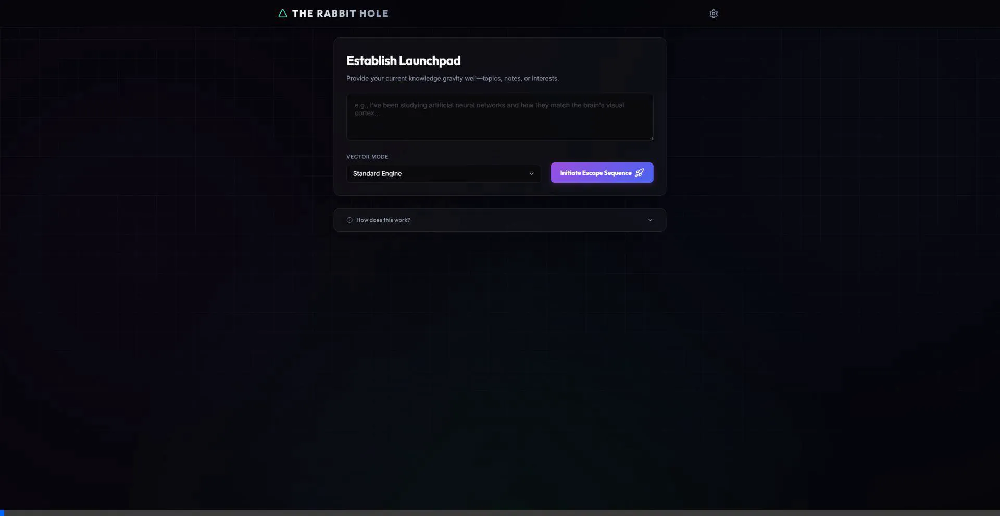

# The Rabbit Hole Engine 🕳️🐇



**The Rabbit Hole** is an Intellectual Boundary Expansion Engine. We all get stuck in our own intellectual bubbles, reading the same types of articles, thinking the same types of thoughts. The Rabbit Hole's sole purpose is to help you escape your knowledge gravity well—the invisible pull that keeps you circling what you already know. 

It does not answer questions. It generates **Curiosity Vectors**: surprising, counter-intuitive pathways into intellectual territory you have never visited.

## Why Use It? (The Value Proposition)
Most search engines give you exactly what you ask for. The Rabbit Hole gives you what you didn't know you needed to ask for. 

By finding the most *surprising* adjacent territories—prioritizing cross-domain collisions, historical blind spots, and counterintuitive inversions—it acts as a serendipity engine for your mind, sparking new ideas, creative breakthroughs, and a broader understanding of the world.

## How It Works (End-to-End Flow)
1. **Enter Your Concept:** Type in any idea, topic, or raw note you are currently thinking about (e.g., "Philosophy of Science").
2. **Expansion:** The engine's AI analyzes your input and calculates 3 highly unexpected conceptual jumps.
3. **The Reveal:** For each vector, you are presented with a card that explains:
   - **The Core Concept:** What the new territory is.
   - **Why It Matters:** Why this is important and relevant to your original idea.
   - **The Surprise:** The unexpected, mind-bending connection that links them.
4. **Dive In:** Click the provided deep-dive link to start exploring your newly discovered intellectual territory.

## Features
- **Standard Mode:** Returns 3 Curiosity Vectors based on your input to escape your conceptual boundaries.
- **Stranger Danger Mode:** Extreme serendipity. Vectors share zero vocabulary with your input and have a Serendipity Score of 8+ out of 10.
- **Collision Mode:** Takes two unrelated fields you provide and finds vectors at their bizarre intersection.
- **Privacy First:** Your Gemini API Key is stored securely and *only* in your browser's local storage.

## Getting Started

### Prerequisites

- Node.js (v20.19+ or v22.12+)
- A [Google Gemini API Key](https://aistudio.google.com/app/apikey)

### Installation

1. Clone or download this repository.
2. Install dependencies:
   ```bash
   npm install
   ```
3. Start the development server:
   ```bash
   npm run dev
   ```
4. Open the provided `localhost` URL in your browser.
5. Click the **Settings icon (gear)** in the top right to input your Gemini API key.
6. Enter a topic and initiate your escape sequence!

## Technology Stack

- Vite
- HTML5 / CSS3 (Vanilla, custom UI framework with dark-mode glassmorphism)
- JavaScript (ES6+)
- Lucide Icons
- Google Gemini API

## License

MIT
